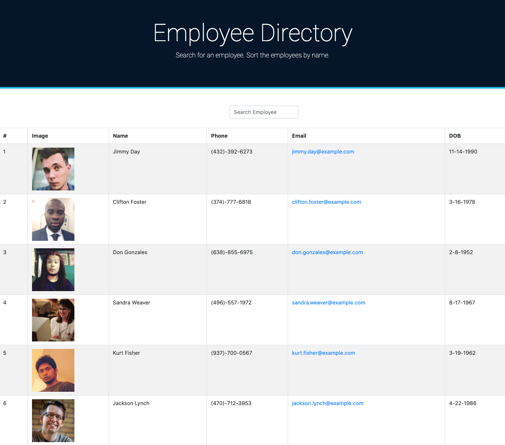
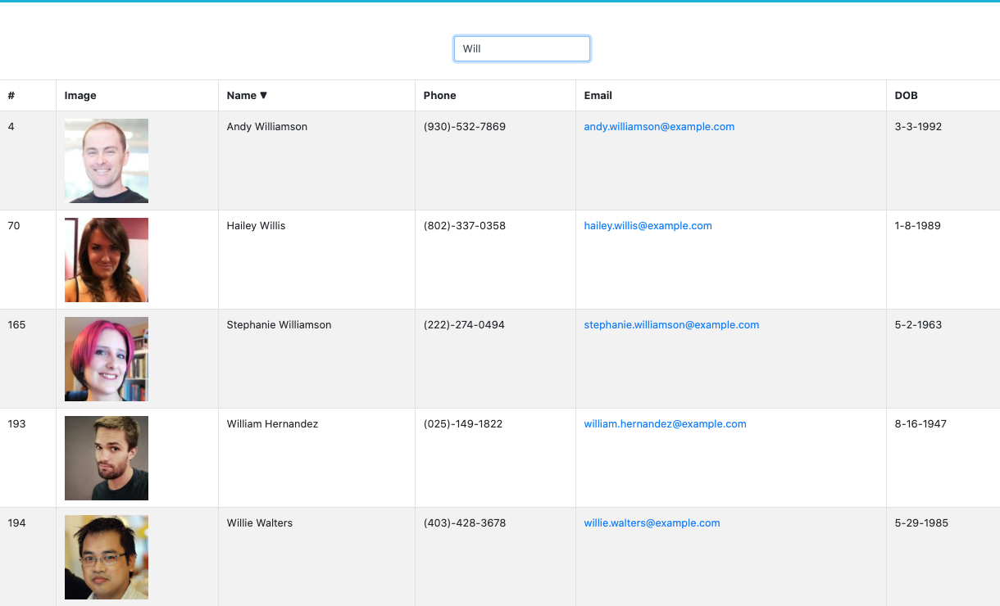
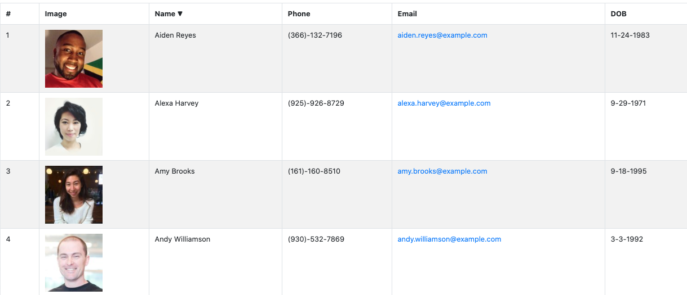

# Employee Directory

  ## Table of Contents
  - [Project description](#project-description)
  - [User story](#user-story)
  - [Installation](#installation)
  - [Features](#features)
  - [Application preview](#application-preview)
  - [Technology](#technology-and-framework)
  - [Contributing](#contributing)
  - [Questions](#questions)
  - [License](#license)

  ## Project Description
  The [**Employee Directory**](https://jonphoenix.github.io/jpx-employee-directory/) provides managers with an access to employees' non-sensitive data. The interface displays the name, phone number, email, date of birth and the photograph of each employee. The **Employee Directory** allows the user to filter and search employees by name.

  ## User Story
  - - -
  - As a manager, I want to be able to view my entire employee directory at once in an organized way
  - So that I have quick access to their non-sensitive information
  - And filter and search any employee by name
  - - -

  ## Installation
  The **Employee Directory** app is deployed in Github pages, no special installation is required other than a web browser for mobile or desktop devices. ([**Google Chrome**](https://www.google.com/chrome/?brand=CHBD&gclid=Cj0KCQjwv7L6BRDxARIsAGj-34pI6kcGFGrZkxQgztLSwZZ7JzwQJFBfDBdgTHCurYEpg3QscMjHhYUaAkkjEALw_wcB&gclsrc=aw.ds) is recommended).

  ## Features
  **Employee Directory:** 
  - Gives the user the option to filter employees by name.
  - Gives the user the option to search any employee by name.
  - Displays the photo, name, phone, email, and date of birth of each employee in a polished table.

  ## Application Preview

  

  

  

  

  ## Technology and Framework  
  - React.js
  - UI components
  - Node.js
  - Github Pages

  ## Contributing
  
 
  
 
 
 [Application repository](https://github.com/JonPhoenix/jpx-employee-directory)

  ## Questions
  - For further questions, please contact the author at: jonphx@uw.edu

  ## License
    MIT
  - - -